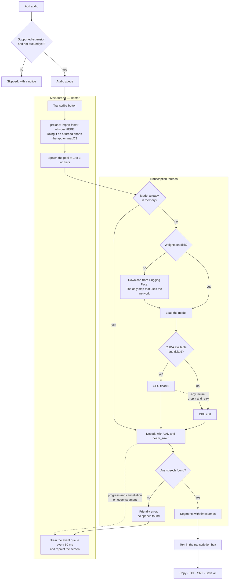
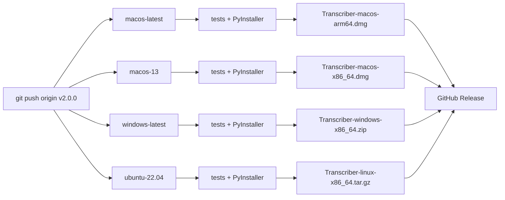

# Transcriber

[](https://github.com/samuelrms/transcriber/actions/workflows/ci.yml)
[](https://github.com/samuelrms/transcriber/actions/workflows/release.yml)
[](LICENSE)


> [Versão em português](README.md) · [Design decisions](DESIGN.md)

Turns **any audio** into text, entirely on your own computer: meetings, interviews,
lectures, podcasts, voice messages. A queue for many files, TXT and SRT export, and an
interface in Portuguese and English.

It uses [`faster-whisper`](https://github.com/SYSTRAN/faster-whisper) (CTranslate2) with a
Tkinter interface wearing the **Nzila** visual identity. **No audio ever leaves the
machine** — no OpenAI API, no Google Speech-to-Text, no cloud.

---

## Contents

- [How it works](#how-it-works)
- [Install to use](#install-to-use)
- [Run from source](#run-from-source)
- [Usage](#usage)
- [Queue and batch transcription](#queue-and-batch-transcription)
- [Models and first download](#models-and-first-download)
- [GPU (CUDA)](#gpu-cuda)
- [Initialise the repository](#initialise-the-repository)
- [Pipelines](#pipelines)
- [Build the installers locally](#build-the-installers-locally)
- [Project layout](#project-layout)
- [Tests](#tests)
- [Troubleshooting](#troubleshooting)
- [Known limitations](#known-limitations)
- [Privacy](#privacy)
- [Licence](#licence)

---

## How it works

From the picked file to the exported text. The interface never freezes because decoding
runs on separate threads that only talk to the screen through an event queue.



Three things the diagram makes explicit:

- **`preload` on the main thread.** Importing `faster-whisper` inside a thread builds a
  `Tk()` off the main thread and macOS kills the process. So the import happens before any
  worker starts.
- **The GPU never takes the transcription down.** Any CUDA failure drops the model and
  redoes the work on CPU, without losing the file from the queue.
- **Network in one step only.** Downloading the model weights is the single thing that
  touches the network, and only the first time each model is used. The audio never leaves
  the machine.

---

## Install to use

Download the file for your platform from the
[**Releases**](https://github.com/samuelrms/transcriber/releases/latest) page. The
binaries do **not** ship Whisper models: the first run downloads the chosen model (needs
internet once).

### macOS

1. Download `Transcriber-macos-arm64.dmg` (Apple Silicon) or
   `Transcriber-macos-x86_64.dmg` (Intel).
2. Open the `.dmg` and drag the app into **Applications**.
3. On first launch Gatekeeper blocks it, because the binary is unsigned. Right-click the
   app → **Open** → **Open**. Or, from the terminal:

```bash
xattr -dr com.apple.quarantine "/Applications/Transcriber.app"
```

### Windows

1. Download `Transcriber-windows-x86_64.zip` and extract it.
2. Run `Transcriber.exe`.
3. SmartScreen may warn about an unsigned executable: **More info** → **Run anyway**.

### Ubuntu / Debian

```bash
sudo apt install python3-tk                       # the interface needs Tk
tar -xzf Transcriber-linux-x86_64.tar.gz
./Transcriber/Transcriber
```

---

## Run from source

Requires **Python 3.11+** and **Tkinter** (Linux: `sudo apt install python3-tk`;
macOS/Homebrew: `brew install python-tk`).

### Windows

```powershell
python -m venv .venv
.venv\Scripts\activate
pip install -r requirements.txt
python app.py
```

### macOS/Linux

```bash
python3 -m venv .venv
source .venv/bin/activate
pip install -r requirements.txt
python app.py
```

> **Important:** always use the virtual environment's Python. Calling the system `python`
> yields *"The faster-whisper library is not installed"*. Without activating the venv, use
> the direct path: `.venv/bin/python app.py` (Windows: `.venv\Scripts\python app.py`).

For tests and builds, also install `pip install -r requirements-dev.txt`.

---

## Usage

1. **Add audio** — one or several files at once. Formats: MP3, WAV, M4A, OGG, OPUS, AAC,
   FLAC. That covers everything from a meeting recorder to WhatsApp voice messages,
   which arrive as `.opus`.
2. Pick the audio **language**, the **model** and how many **concurrent** transcriptions.
3. **Transcribe**. The path line advances and you can **Cancel** at any moment.
4. Click a file in the queue to read its transcription.
5. **Copy text**, **Save TXT**, **Save SRT**, **Save all** (TXT + SRT for everything
   finished) or **Open folder**.

Summary shown when a file finishes:

```text
File: meeting-2026-08-15.mp3
Detected language: Portuguese (pt) — confidence 100%
Model: medium
Device: CPU
Audio duration: 00:20
Processing time: 7.4 seconds
```

Generated SRT:

```text
1
00:00:00,000 --> 00:00:04,500
Olá, tudo bem?

2
00:00:04,500 --> 00:00:08,200
Estou enviando esse áudio...
```

The **interface** field switches every string between **Português (BR)** and **English**
instantly, without restarting and without losing the queue.

---

## Queue and batch transcription

Every file carries its own state: **queued**, **transcribing** (with a percentage),
**done** (with the elapsed time), **error** (with the reason) or **cancelled**. A failing
file never stops the others.

To drop a file: select it and click **Remove selected** (or press `Delete`). **Remove
finished** clears only completed ones; **Clear queue** empties everything. None of these
touch your files on disk.

The **concurrent** field controls how many files run at the same time:

| Value | When to use |
| ----- | ----------- |
| **1 · queue** (default) | Almost always. CTranslate2 already uses every core on a single file. |
| 2 or 3 · parallel | Only with light models (`tiny`, `base`, `small`) and spare RAM. |

Running `medium` or `large-v3` in parallel multiplies memory use **without** getting
faster on CPU — the application warns you when that combination is picked.

---

## Models and first download

The first time a model is used its weights are downloaded from Hugging Face into
`~/.cache/huggingface/hub` (Windows: `%USERPROFILE%\.cache\huggingface\hub`). After that
**everything runs offline**. Your audio is never uploaded: only weights are downloaded.

The application only shows the download notice for a model that is **not on disk yet**.

| Model      | Download | RAM (int8) | When to use |
| ---------- | -------- | ---------- | ----------- |
| `tiny`     | ~75 MB   | ~0.5 GB    | Just checking that it works |
| `base`     | ~145 MB  | ~0.7 GB    | Very limited machine |
| `small`    | ~480 MB  | ~1.5 GB    | Weak CPU or long audio, in a hurry |
| `medium`   | ~1.5 GB  | ~3 GB      | **Default — best accuracy on CPU** |
| `large-v3` | ~2.9 GB  | ~5 GB      | Only with an NVIDIA GPU and 16 GB+ RAM |

Measured in this project (macOS, Apple Silicon, CPU `int8`) on a **19.5 s** voice
message:

| Model    | Time   | Share of the duration |
| -------- | ------ | --------------------- |
| `small`  | ~3.3 s | ~1/6                  |
| `medium` | ~7.3 s | ~1/3                  |

Real quality difference on that clip: `small` produced "últimas **águas**" and "cinco
pessoas **minhas**"; `medium` got "últimas **vagas**" and "cinco pessoas **mesmo**" right.
Spontaneous speech punishes a small model; a clean recording forgives much more.

---

## GPU (CUDA)

- NVIDIA GPUs are detected through CTranslate2 and the **use CUDA** option appears
  automatically. **With no CUDA on the system the control is not rendered at all.**
- Requires CUDA 12 plus cuBLAS/cuDNN 9.
- Any failure (driver, VRAM, missing cuDNN) retries the transcription **automatically on
  the CPU**, with a note in the status line.
- macOS has no CUDA: always CPU (`int8`).

---

## Initialise the repository

The project already ships `.gitignore`, `LICENSE` and the workflows.

```bash
cd /path/to/transcript

git init
git add .
git commit -m "feat: offline audio transcription with batch queue and Nzila identity"
git branch -M main
```

Create the repository on GitHub (empty, no README) and connect it:

```bash
git remote add origin git@github.com:samuelrms/transcriber.git
git push -u origin main
```

What **stays out** of the repository, by `.gitignore` decision: `.venv/`, `build/` and
`dist/`, whatever is in `output/`, `transcriber.log` and **every audio file** — that rule
exists so a personal recording is never committed by accident.

What **goes in**: the `.ttf` fonts under `assets/fonts` with their OFL licences, needed by
the interface and by the build.

### Publish a version

```bash
git tag v2.0.0
git push origin v2.0.0
```

The tag triggers the release workflow, which builds the four variants, runs the tests on
each and publishes everything under **Releases**. Without a tag, nothing is published.

---

## Pipelines

Two workflows in [`.github/workflows/`](.github/workflows):

### `ci.yml` — on every push and pull request

| Job | What it does |
| --- | --- |
| `test` | Lint (`pyflakes`) and the full suite across **9 combinations**: Ubuntu, macOS and Windows × Python 3.11, 3.12 and 3.13. Installs only `pytest` and `pyflakes`, because no test needs Whisper — it runs in under a minute. |
| `smoke` | Installs the real dependencies on Ubuntu, confirms Tkinter is present and **builds the actual window** under `xvfb`, on a virtual display. Catches layout and theming errors unit tests cannot see. |

### `release.yml` — when a `v*` tag is pushed

Builds in parallel, each target on its own runner, because PyInstaller **never
cross-compiles**:

| Runner | Artifact | Format |
| --- | --- | --- |
| `macos-latest` | `Transcriber-macos-arm64.dmg` | `.app` in a disk image |
| `macos-13` | `Transcriber-macos-x86_64.dmg` | same, for Intel |
| `windows-latest` | `Transcriber-windows-x86_64.zip` | single `.exe` |
| `ubuntu-22.04` | `Transcriber-linux-x86_64.tar.gz` | compressed folder |

Every job runs the tests **before** packaging and fails early, with a clear message, if
Tkinter is unavailable — better than shipping a binary whose interface cannot open. At the
end the `release` job gathers everything into a GitHub release with generated notes.



Ubuntu pins `ubuntu-22.04` on purpose: a binary compiled against a newer glibc will not
run on older distributions, while the other way round works.

---

## Build the installers locally

```bash
pip install -r requirements-dev.txt
pyinstaller --noconfirm --clean Transcriber.spec
```

One `.spec` serves all three systems and picks the format from the system it runs on:

| System | Output | Note |
| --- | --- | --- |
| macOS | `dist/Transcriber.app` | ~179 MB, folder inside the bundle |
| Linux | `dist/Transcriber/` | folder; ship it as a `.tar.gz` |
| Windows | `dist/Transcriber.exe` | single file |

In all three the `.spec` collects what PyInstaller cannot find on its own: CTranslate2
native libraries, PyAV's FFmpeg binaries, the VAD ONNX model, the onnxruntime runtime,
`tokenizers`/`huggingface-hub` metadata and the brand fonts.

A packaged build **never writes inside its own bundle**: the log goes to
`~/Library/Logs/Transcriber` (macOS) or the user data directory, and the folder
suggested when saving is `~/Documents/Transcriber`.

---

## Project layout

Code, comments, file and folder names are in **English**; every string the user reads
lives in `i18n.py`, in Portuguese and English.

```text
transcript/
├── app.py                     # entry point
├── conftest.py                # makes the package importable in tests
├── requirements.txt           # runtime dependencies
├── requirements-dev.txt       # pytest, pyflakes and pyinstaller
├── Transcriber.spec      # cross-platform build
├── LICENSE                    # MIT, with third-party licences
├── README.md / README.en.md   # this file, in both languages
├── DESIGN.md                  # the Nzila identity inside Tkinter
│
├── .github/workflows/
│   ├── ci.yml                 # lint + tests + headless window
│   └── release.yml            # binaries for macOS, Windows and Ubuntu
│
├── assets/fonts/              # Fraunces + Instrument Sans (OFL) and licences
│
├── transcriber/
│   ├── i18n.py                # pt-BR / en catalog
│   ├── config.py              # models, extensions, VAD parameters
│   ├── errors.py              # exceptions carrying translation keys
│   ├── audio.py               # file and extension validation
│   ├── srt.py                 # timestamps and SRT assembly
│   ├── device.py              # CUDA detection, CPU/GPU profiles
│   ├── transcription.py       # model, cache, transcription, errors
│   ├── batch.py               # queue, state and aggregate progress
│   ├── model_store.py         # which models are already downloaded
│   ├── paths.py               # directories from source and when frozen
│   ├── fonts.py               # process-scoped font registration
│   ├── logging_setup.py       # file + terminal logging
│   ├── desktop.py             # open the folder in the file manager
│   └── ui/
│       ├── theme.py           # Nzila tokens and ttk styles
│       ├── widgets.py         # path line, buttons and cards
│       ├── worker.py          # thread pool + event queue
│       └── main_window.py     # main window
│
├── output/                    # saved TXT and SRT (default suggestion)
└── tests/                     # 124 tests, none downloads a model
```

Whisper logic lives in `transcription.py`; the interface knows nothing about
`faster_whisper`, and the pure modules (`srt.py`, `audio.py`, `batch.py`) import neither
Tkinter nor the model.

---

## Tests

```bash
pip install -r requirements-dev.txt
pytest -q
```

**124 tests** in about 0.15 s: SRT timestamps, subtitle generation, extension validation,
duration, progress, GPU to CPU fallback, model caching, the batch queue, downloaded-model
detection, frozen-build directories and translation catalog symmetry. **No Whisper model
is downloaded during the tests.**

---

## Troubleshooting

| Problem | Fix |
| --- | --- |
| `The faster-whisper library is not installed` | You ran the system Python. Use `.venv/bin/python app.py` or activate the venv. |
| macOS: "app is damaged" or blocked | Unsigned binary. Right-click → **Open**, or `xattr -dr com.apple.quarantine`. |
| `ModuleNotFoundError: No module named 'tkinter'` | Linux: `sudo apt install python3-tk`. macOS/Homebrew: `brew install python-tk`. |
| Model download stuck at 0 bytes | A bug in the `hf-xet` backend of `huggingface_hub`. Run with `HF_HUB_DISABLE_XET=1`. |
| "Not enough memory" | Smaller model and **concurrent** at `1 · queue`. |
| "No speech was found" | The VAD found no voice: silence, music or noise. |
| Transcription is very slow | Use `small` or `base`; `medium`/`large-v3` are inherently slow on CPU. |
| `Library cublas64_12.dll is not found` | Install CUDA Toolkit 12 and cuDNN 9, or untick **use CUDA**. |
| Interface shows an odd serif font | The fonts in `assets/fonts` did not register. Check the `.ttf` files are there. |
| I want the technical error | `transcriber.log` in the project root (or `~/Library/Logs/Transcriber` in the packaged build). |

---

## Known limitations

- Quality depends on the model and the audio; slang, noise and overlapping speakers hurt
  accuracy.
- No speaker diarization.
- `medium` and `large-v3` are heavy for most CPUs.
- Parallel transcription exists but barely helps on CPU — the queue is the right path.
- The published binaries are **unsigned**.
- Python 3.14 works, but 3.11/3.12 is the best tested combination for the dependencies.

---

## Privacy

**Transcription runs locally on your computer.**

- No audio, text or metadata leaves the machine.
- The only network connection is the model weight download on first use.
- After that it works fully offline.
- The log records events and errors — never the transcribed content.

---

## Licence

[MIT](LICENSE). Third-party components keep their own licences: faster-whisper and
CTranslate2 (MIT), PyAV (BSD-3) bundling FFmpeg (LGPL), Whisper weights (MIT, fetched at
run time) and the Fraunces and Instrument Sans fonts (OFL 1.1).
