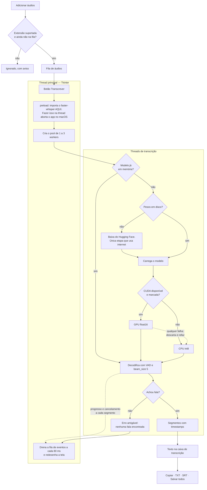
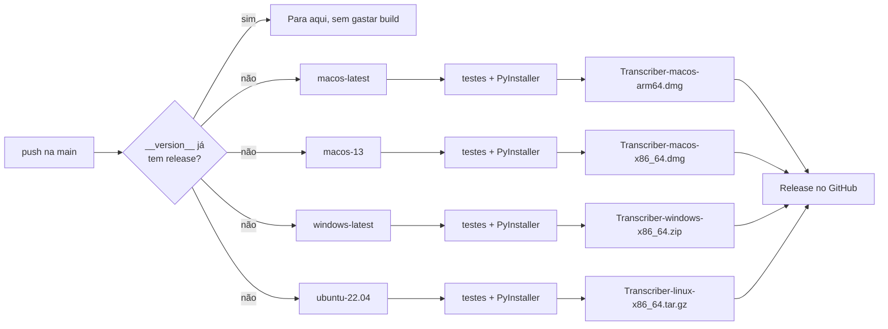

# Transcriber

[](https://github.com/samuelrms/transcriber/actions/workflows/ci.yml)
[](https://github.com/samuelrms/transcriber/actions/workflows/release.yml)
[](LICENSE)


> [English version](README.en.md) · [Decisões de design](DESIGN.md)

Transcreve **qualquer áudio** em texto, 100% no seu computador: reunião, entrevista,
aula, podcast, mensagem de voz. Fila para vários arquivos, exportação em TXT e SRT, e
interface em português e inglês.

Usa [`faster-whisper`](https://github.com/SYSTRAN/faster-whisper) (CTranslate2) com
interface Tkinter vestida na identidade visual **Nzila**. **Nenhum áudio sai da máquina** —
sem OpenAI API, sem Google Speech-to-Text, sem nuvem.

---

## Índice

- [Como funciona](#como-funciona)
- [Instalação para usar](#instalação-para-usar)
- [Rodar a partir do código](#rodar-a-partir-do-código)
- [Como usar](#como-usar)
- [Fila e transcrição em lote](#fila-e-transcrição-em-lote)
- [Modelos e primeiro download](#modelos-e-primeiro-download)
- [GPU (CUDA)](#gpu-cuda)
- [Inicializar o repositório](#inicializar-o-repositório)
- [Pipelines](#pipelines)
- [Gerar os instaladores localmente](#gerar-os-instaladores-localmente)
- [Estrutura do projeto](#estrutura-do-projeto)
- [Testes](#testes)
- [Troubleshooting](#troubleshooting)
- [Limitações conhecidas](#limitações-conhecidas)
- [Privacidade](#privacidade)
- [Licença](#licença)

---

## Como funciona

Do arquivo escolhido até o texto exportado. A interface nunca trava porque a decodificação
roda em threads separadas, que só conversam com a tela por uma fila de eventos.



Três detalhes que o diagrama torna explícitos:

- **`preload` na thread principal.** Importar o `faster-whisper` dentro de uma thread cria
  um `Tk()` fora da main thread e o macOS mata o processo. Por isso o import acontece
  antes de qualquer worker subir.
- **A GPU nunca derruba a transcrição.** Qualquer falha em CUDA descarta o modelo e refaz
  o trabalho em CPU, sem perder o arquivo da fila.
- **Internet só numa etapa.** Baixar os pesos do modelo é a única coisa que usa rede, e só
  na primeira vez de cada modelo. O áudio nunca sai da máquina.

---

## Instalação para usar

Baixe o arquivo da sua plataforma na página de
[**Releases**](https://github.com/samuelrms/transcriber/releases/latest). Os
binários **não** trazem os modelos Whisper: o primeiro uso baixa o modelo escolhido
(precisa de internet uma vez).

### macOS

1. Baixe `Transcriber-macos-arm64.dmg` (Apple Silicon) ou
   `Transcriber-macos-x86_64.dmg` (Intel).
2. Abra o `.dmg` e arraste o app para **Aplicativos**.
3. Na primeira execução o Gatekeeper bloqueia, porque o binário não é assinado.
   Clique com o botão direito no app → **Abrir** → **Abrir**. Ou, pelo terminal:

```bash
xattr -dr com.apple.quarantine "/Applications/Transcriber.app"
```

### Windows

1. Baixe `Transcriber-windows-x86_64.zip` e extraia.
2. Rode `Transcriber.exe`.
3. O SmartScreen pode avisar por ser um executável não assinado: **Mais informações** →
   **Executar assim mesmo**.

### Ubuntu / Debian

```bash
sudo apt install python3-tk                       # a interface precisa do Tk
tar -xzf Transcriber-linux-x86_64.tar.gz
./Transcriber/Transcriber
```

---

## Rodar a partir do código

Requer **Python 3.11+** e **Tkinter** (Linux: `sudo apt install python3-tk`;
macOS/Homebrew: `brew install python-tk`).

### Windows

```powershell
python -m venv .venv
.venv\Scripts\activate
pip install -r requirements.txt
python app.py
```

### macOS/Linux

```bash
python3 -m venv .venv
source .venv/bin/activate
pip install -r requirements.txt
python app.py
```

> **Importante:** use sempre o Python do ambiente virtual. Chamar o `python` do sistema
> resulta em *"A biblioteca faster-whisper não está instalada"*. Sem ativar o venv, use
> o caminho direto: `.venv/bin/python app.py` (Windows: `.venv\Scripts\python app.py`).

Para testes e build, instale também `pip install -r requirements-dev.txt`.

---

## Como usar

1. **Adicionar áudios** — um ou vários de uma vez. Formatos: MP3, WAV, M4A, OGG, OPUS,
   AAC, FLAC. Isso cobre desde gravador de reunião até as mensagens de voz do WhatsApp,
   que saem em `.opus`.
2. Escolha o **idioma** do áudio, o **modelo** e quantas transcrições **simultâneas**.
3. **Transcrever**. A linha de progresso avança e dá para **Cancelar** a qualquer momento.
4. Clique em um arquivo da fila para ler a transcrição dele.
5. **Copiar texto**, **Salvar TXT**, **Salvar SRT**, **Salvar todos** (TXT + SRT de tudo
   que terminou) ou **Abrir pasta**.

Resumo exibido ao terminar:

```text
Arquivo: reuniao-2026-08-15.mp3
Idioma detectado: Português (pt) — confiança 100%
Modelo: medium
Dispositivo: CPU
Duração do áudio: 00:20
Tempo de processamento: 7.4 segundos
```

SRT gerado:

```text
1
00:00:00,000 --> 00:00:04,500
Olá, tudo bem?

2
00:00:04,500 --> 00:00:08,200
Estou enviando esse áudio...
```

O campo **interface** troca todos os textos entre **Português (BR)** e **English** na
hora, sem reiniciar e sem perder a fila.

---

## Fila e transcrição em lote

Cada arquivo tem seu estado: **na fila**, **transcrevendo** (com porcentagem),
**concluído** (com o tempo), **erro** (com o motivo) ou **cancelado**. Um arquivo com erro
não interrompe os outros.

Para tirar um arquivo da lista: selecione e clique em **Remover selecionado** (ou tecle
`Delete`). **Remover concluídos** limpa só os terminados; **Limpar fila** esvazia tudo.
Nenhuma dessas ações mexe nos seus arquivos em disco.

O campo **simultâneas** controla quantos arquivos rodam ao mesmo tempo:

| Valor | Quando usar |
| ----- | ----------- |
| **1 · fila** (padrão) | Praticamente sempre. O CTranslate2 já usa todos os núcleos em um arquivo só. |
| 2 ou 3 · paralelo | Só com modelos leves (`tiny`, `base`, `small`) e RAM sobrando. |

Rodar `medium` ou `large-v3` em paralelo multiplica a memória usada **sem** acelerar em
CPU — a aplicação avisa quando essa combinação é escolhida.

---

## Modelos e primeiro download

Na primeira vez que um modelo é usado, os pesos são baixados do Hugging Face para
`~/.cache/huggingface/hub` (Windows: `%USERPROFILE%\.cache\huggingface\hub`). Depois
disso **tudo roda offline**. O áudio nunca é enviado: só os pesos são baixados.

A aplicação só mostra o aviso de download para o modelo que **ainda não está no disco**.

| Modelo     | Download  | RAM (int8) | Quando usar |
| ---------- | --------- | ---------- | ----------- |
| `tiny`     | ~75 MB    | ~0,5 GB    | Só para testar se funciona |
| `base`     | ~145 MB   | ~0,7 GB    | Máquina bem limitada |
| `small`    | ~480 MB   | ~1,5 GB    | CPU fraca ou áudio longo, com pressa |
| `medium`   | ~1,5 GB   | ~3 GB      | **Padrão — melhor precisão em CPU** |
| `large-v3` | ~2,9 GB   | ~5 GB      | Só com GPU NVIDIA e 16 GB+ de RAM |

Medido neste projeto (macOS, Apple Silicon, CPU `int8`) com uma mensagem de voz de
**19,5 s**:

| Modelo   | Tempo  | Proporção da duração |
| -------- | ------ | -------------------- |
| `small`  | ~3,3 s | ~1/6                 |
| `medium` | ~7,3 s | ~1/3                 |

Diferença real de qualidade nesse áudio: o `small` produziu "últimas **águas**" e "cinco
pessoas **minhas**"; o `medium` acertou "últimas **vagas**" e "cinco pessoas **mesmo**".
Fala espontânea castiga modelo pequeno; áudio bem gravado perdoa mais.

---

## GPU (CUDA)

- GPUs NVIDIA são detectadas via CTranslate2 e a opção **usar CUDA** aparece
  automaticamente. **Sem CUDA no sistema, o controle nem é exibido.**
- Requer CUDA 12 + cuBLAS/cuDNN 9.
- Qualquer falha (driver, VRAM, cuDNN ausente) faz a transcrição ser **refeita
  automaticamente na CPU**, com aviso na barra de status.
- macOS não tem CUDA: sempre CPU (`int8`).

---

## Inicializar o repositório

O projeto já vem com `.gitignore`, `LICENSE` e workflows prontos.

```bash
cd /caminho/para/transcript

git init
git add .
git commit -m "feat: transcrição de áudio offline com fila e identidade Nzila"
git branch -M main
```

Crie o repositório no GitHub (vazio, sem README) e conecte:

```bash
git remote add origin git@github.com:samuelrms/transcriber.git
git push -u origin main
```

O que **não** vai para o repositório, por decisão do `.gitignore`: o `.venv/`, as pastas
`build/` e `dist/`, os arquivos em `output/`, o `transcriber.log` e **qualquer arquivo de
áudio** — a regra existe para nunca versionar gravação pessoal por acidente.

O que **vai**: as fontes `.ttf` em `assets/fonts` com suas licenças OFL, necessárias para
a interface e para o build.

### Publicar uma versão

A release é automática: sai a cada merge ou push direto na `main`, **desde que a versão
tenha mudado**. Quem decide isso é o `__version__`:

```bash
# 1. suba a versão no pacote
sed -i '' 's/__version__ = "1.0.0"/__version__ = "1.1.0"/' transcriber/__init__.py

# 2. mande para a main, direto ou por pull request
git commit -am "chore: bump version to 1.1.0"
git push origin main
```

O workflow lê o `__version__`, monta a tag `v1.1.0` e verifica se ela já existe no
repositório:

- **não existe** → compila as quatro variantes, roda os testes em cada uma, cria a tag no
  commit e publica tudo em **Releases**;
- **já existe** → pula o build inteiro e registra um aviso no run. Commit comum não gera
  release nem gasta minutos de CI.

Não é preciso criar tag na mão: ela nasce junto da release, no mesmo commit, então a
versão do código e a tag do repositório nunca divergem. O `Transcriber.spec` também lê o
`__version__`, de modo que o `Info.plist` do app carrega o mesmo número.

---

## Pipelines

Dois workflows em [`.github/workflows/`](.github/workflows):

### `ci.yml` — a cada push e pull request

| Job | O que faz |
| --- | --- |
| `test` | Lint (`pyflakes`) e a suíte completa em **9 combinações**: Ubuntu, macOS e Windows × Python 3.11, 3.12 e 3.13. Instala só `pytest` e `pyflakes`, porque nenhum teste precisa do Whisper — roda em menos de um minuto. |
| `smoke` | Instala as dependências de verdade no Ubuntu, confirma que o Tkinter existe e **monta a janela real** sob `xvfb`, num display virtual. Pega erro de layout e de tema que teste unitário não vê. |

### `release.yml` — a cada merge ou push na `main`

Primeiro um job curto lê o `__version__` e decide se há o que publicar. Se a tag
correspondente já existe, tudo para ali. Se não existe, compila em paralelo, cada alvo no
seu próprio runner, porque o PyInstaller **não faz cross-compile**:

| Runner | Artefato | Formato |
| --- | --- | --- |
| `macos-latest` | `Transcriber-macos-arm64.dmg` | `.app` em imagem de disco |
| `macos-13` | `Transcriber-macos-x86_64.dmg` | idem, para Intel |
| `windows-latest` | `Transcriber-windows-x86_64.zip` | `.exe` único |
| `ubuntu-22.04` | `Transcriber-linux-x86_64.tar.gz` | pasta compactada |

Cada job roda os testes **antes** de empacotar e falha cedo, com mensagem clara, se o
Tkinter não estiver disponível — melhor do que publicar um binário cuja interface não
abre. No fim, o job `release` junta tudo em uma release do GitHub com notas geradas
automaticamente.



O Ubuntu usa `ubuntu-22.04` de propósito: binário compilado em uma glibc mais nova não
roda em distribuições mais antigas, o contrário funciona.

---

## Gerar os instaladores localmente

```bash
pip install -r requirements-dev.txt
pyinstaller --noconfirm --clean Transcriber.spec
```

O mesmo `.spec` serve para os três sistemas e decide o formato pelo sistema em que roda:

| Sistema | Saída | Observação |
| --- | --- | --- |
| macOS | `dist/Transcriber.app` | ~179 MB, pasta dentro do bundle |
| Linux | `dist/Transcriber/` | pasta; distribua como `.tar.gz` |
| Windows | `dist/Transcriber.exe` | arquivo único |

Nos três casos o `.spec` coleta o que o PyInstaller não descobre sozinho: bibliotecas
nativas do CTranslate2, binários do FFmpeg do PyAV, o modelo ONNX do VAD, o runtime do
onnxruntime, metadados de `tokenizers`/`huggingface-hub` e as fontes da marca.

Uma build empacotada **não escreve dentro do próprio bundle**: o log vai para
`~/Library/Logs/Transcriber` (macOS) ou o diretório de dados do usuário, e a pasta
sugerida ao salvar é `~/Documents/Transcriber`.

---

## Estrutura do projeto

Código, comentários, nomes de arquivos e pastas em **inglês**; todo texto que o usuário
lê fica em `i18n.py`, em português e inglês.

```text
transcript/
├── app.py                     # ponto de entrada
├── conftest.py                # deixa o pacote importável nos testes
├── requirements.txt           # dependências de execução
├── requirements-dev.txt       # pytest, pyflakes e pyinstaller
├── Transcriber.spec      # build multiplataforma
├── LICENSE                    # MIT, com as licenças de terceiros
├── README.md / README.en.md   # este arquivo, nos dois idiomas
├── DESIGN.md                  # a identidade Nzila dentro do Tkinter
│
├── .github/workflows/
│   ├── ci.yml                 # lint + testes + janela headless
│   └── release.yml            # binários para macOS, Windows e Ubuntu
│
├── assets/fonts/              # Fraunces + Instrument Sans (OFL) e licenças
│
├── transcriber/
│   ├── i18n.py                # catálogo pt-BR / en
│   ├── config.py              # modelos, extensões, parâmetros do VAD
│   ├── errors.py              # exceções com chaves de tradução
│   ├── audio.py               # validação de arquivo e extensão
│   ├── srt.py                 # timestamps e montagem do SRT
│   ├── device.py              # detecção de CUDA, perfis CPU/GPU
│   ├── transcription.py       # modelo, cache, transcrição, erros
│   ├── batch.py               # fila, estado e progresso agregado
│   ├── model_store.py         # quais modelos já estão baixados
│   ├── paths.py               # diretórios no código e no binário
│   ├── fonts.py               # registro das fontes só no processo
│   ├── logging_setup.py       # log em arquivo + terminal
│   ├── desktop.py             # abrir a pasta no gerenciador de arquivos
│   └── ui/
│       ├── theme.py           # tokens Nzila e estilos ttk
│       ├── widgets.py         # linha do caminho, botões e cartões
│       ├── worker.py          # pool de threads + fila de eventos
│       └── main_window.py     # janela principal
│
├── output/                    # TXT e SRT salvos (sugestão padrão)
└── tests/                     # 124 testes, nenhum baixa modelo
```

A lógica de Whisper vive em `transcription.py`; a interface não sabe nada sobre
`faster_whisper`, e os módulos puros (`srt.py`, `audio.py`, `batch.py`) não importam nem
Tkinter nem o modelo.

---

## Testes

```bash
pip install -r requirements-dev.txt
pytest -q
```

**124 testes** em torno de 0,15 s: timestamps SRT, geração de legenda, validação de
extensões, duração, progresso, fallback de GPU para CPU, cache do modelo, fila em lote,
detecção de modelo baixado, diretórios em build congelada e a simetria dos catálogos de
tradução. **Nenhum modelo Whisper é baixado durante os testes.**

---

## Troubleshooting

| Problema | Solução |
| --- | --- |
| `A biblioteca faster-whisper não está instalada` | Você rodou com o Python do sistema. Use `.venv/bin/python app.py` ou ative o venv. |
| macOS: "app danificado" ou bloqueado | Binário não assinado. Botão direito → **Abrir**, ou `xattr -dr com.apple.quarantine`. |
| `ModuleNotFoundError: No module named 'tkinter'` | Linux: `sudo apt install python3-tk`. macOS/Homebrew: `brew install python-tk`. |
| Download do modelo trava em 0 byte | Bug do backend `hf-xet` do `huggingface_hub`. Rode com `HF_HUB_DISABLE_XET=1`. |
| "Memória insuficiente" | Modelo menor e **simultâneas** em `1 · fila`. |
| "Nenhuma fala foi encontrada" | O VAD não achou voz: silêncio, música ou ruído. |
| Transcrição muito lenta | Use `small` ou `base`; `medium`/`large-v3` em CPU são lentos por natureza. |
| `Library cublas64_12.dll is not found` | Instale CUDA Toolkit 12 e cuDNN 9, ou desmarque **usar CUDA**. |
| Interface com fonte serifada estranha | As fontes de `assets/fonts` não registraram. Confira se os `.ttf` estão lá. |
| Quero o erro técnico | `transcriber.log` na raiz do projeto (ou em `~/Library/Logs/Transcriber` na versão empacotada). |

---

## Limitações conhecidas

- A qualidade depende do modelo e do áudio; gíria, ruído e falantes sobrepostos derrubam
  a precisão.
- Não há separação de falantes (*diarization*).
- `medium` e `large-v3` são pesados para a maioria das CPUs.
- Transcrição paralela existe, mas em CPU quase não acelera — a fila é o caminho certo.
- Os binários publicados **não são assinados**.
- Python 3.14 funciona, mas 3.11/3.12 é o combo mais testado pelas dependências.

---

## Privacidade

**Transcrição realizada localmente no seu computador.**

- Nenhum áudio, texto ou metadado sai da máquina.
- A única conexão de rede é o download dos pesos do modelo no primeiro uso.
- Depois disso, funciona totalmente offline.
- O log grava eventos e erros — nunca o conteúdo transcrito.

---

## Licença

[MIT](LICENSE). Componentes de terceiros mantêm suas licenças: faster-whisper e
CTranslate2 (MIT), PyAV (BSD-3) com FFmpeg (LGPL), pesos Whisper (MIT, baixados em tempo
de execução) e as fontes Fraunces e Instrument Sans (OFL 1.1).
